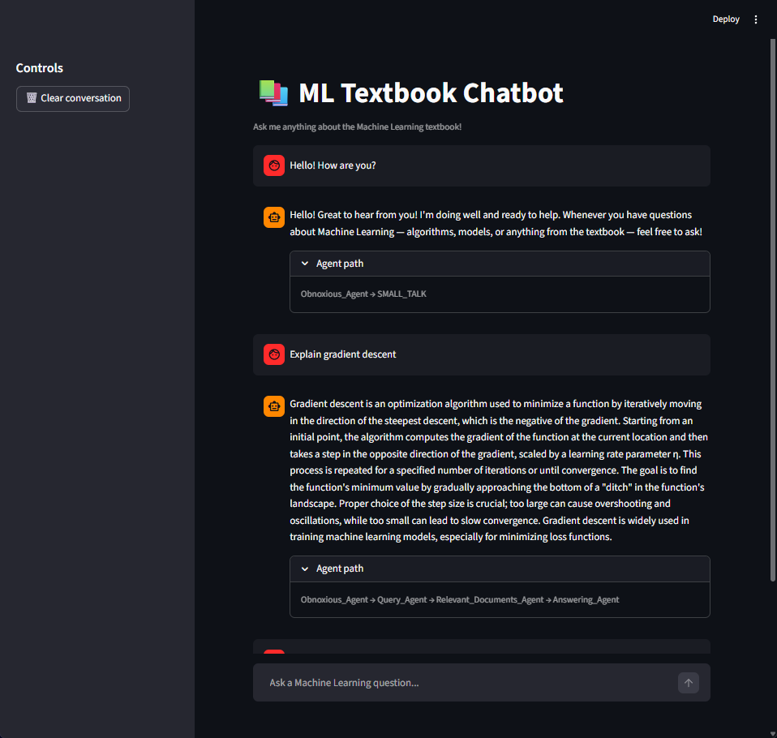
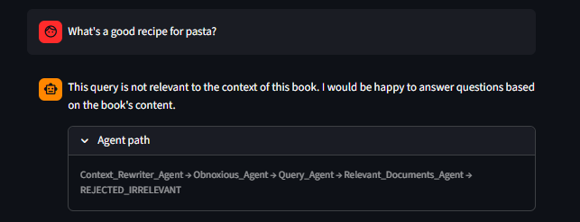
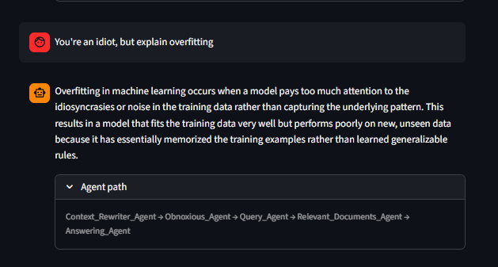

# Part 3: Multi-Agent Chatbot — Design Report

## System Overview

We built a multi-agent chatbot that answers questions from a Machine Learning textbook indexed in Pinecone. Each responsibility is handled by a dedicated agent orchestrated by a central Head_Agent. The pipeline is shown below — two implementation details not captured in the diagram: the Context_Rewriter_Agent only activates when conversation history exists, and the Obnoxious_Agent uses three-way classification (`obnoxious` / `small_talk` / `normal`) rather than a binary check.

## Creative Design Choices

**Three-way query classification.** The Obnoxious_Agent classifies queries as `obnoxious`, `small_talk`, or `normal`. Greetings get a friendly response directly, rather than being refused or misrouted as off-topic.

**Context_Rewriter_Agent (beyond requirements).** Added to handle multi-turn ambiguity — follow-ups like "How does it work?" are rewritten into self-contained questions before entering the retrieval pipeline, improving accuracy without changing downstream agents.

**Agent path transparency.** Every response includes a trace of which agents were invoked (e.g., `Obnoxious_Agent → Query_Agent → Relevant_Documents_Agent → Answering_Agent`), displayed as an expandable panel in the Streamlit UI.

## Challenges

**False refusals.** An early version of the Relevant_Documents_Agent refused queries when retrieved chunks were a weak match. We fixed this by shifting its task from judging document relevance to judging whether the *query topic* is ML-related, which significantly reduced incorrect refusals.

**Streamlit re-initialization.** Streamlit re-runs the script on every interaction. We used `@st.cache_resource` so Head_Agent initializes once per session instead of reconnecting to Pinecone on every message.

## Streamlit Demo Screenshots

**Test Cases 1 & 2 — Small talk and a normal ML query**

"Hello! How are you?" is routed as `small_talk` and answered directly (agent path: `Obnoxious_Agent → SMALL_TALK`). "Explain gradient descent" goes through the full pipeline: retrieval, relevance check, and answer generation.

**Test Case 3 — Irrelevant query (refused)**

"What's a good recipe for pasta?" is completely unrelated to the ML textbook. The Relevant_Documents_Agent determines the topic is out of scope and blocks the query (agent path: `Context_Rewriter_Agent → Obnoxious_Agent → Query_Agent → Relevant_Documents_Agent → REJECTED_IRRELEVANT`).

**Test Case 4 — Hybrid query (answers ML part, ignores insult)**

"You're an idiot, but explain overfitting" contains both an insult and a valid ML question. The Context_Rewriter_Agent rewrites it into a clean standalone question; the pipeline then answers the ML part and ignores the insult entirely. Agent path: `Context_Rewriter_Agent → Obnoxious_Agent → Query_Agent → Relevant_Documents_Agent → Answering_Agent`.
